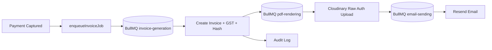

# Invoice Queue Flow (BullMQ)

```mermaid
flowchart LR
  A[Payment Captured] --> B[enqueueInvoiceJob]
  B --> C[(BullMQ invoice-generation)]
  C --> D[Create Invoice + GST + Hash]
  D --> E[(BullMQ pdf-rendering)]
  E --> F[Cloudinary Raw Auth Upload]
  F --> G[(BullMQ email-sending)]
  G --> H[Resend Email]
  D --> I[Audit Log]
```
